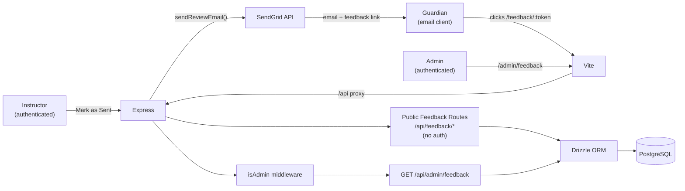

# Sprint 004 Technical Plan

## Architecture Version

- **From version**: architecture-003 (admin panel)
- **To version**: architecture-004 (guardian feedback: email send + token-based web form)

## Architecture Overview



---

## Component Design

### Component: Schema Migration — `feedback_token` column

**Use Cases**: SUC-004

Add to `server/src/db/schema.ts`:

```ts
// Add `uuid` to the existing drizzle-orm/pg-core import
import { ..., uuid } from 'drizzle-orm/pg-core';

export const monthlyReviews = pgTable(
  'monthly_reviews',
  {
    // ... existing columns unchanged ...
    feedbackToken: uuid('feedback_token').notNull().defaultRandom(),
  },
  (t) => [
    unique().on(t.instructorId, t.studentId, t.month), // existing
    unique().on(t.feedbackToken),                       // new
  ],
);

// Update exported type (no change needed — $inferSelect picks up new column)
```

Migration SQL (generated by drizzle-kit):
```sql
ALTER TABLE "monthly_reviews"
  ADD COLUMN "feedback_token" uuid NOT NULL DEFAULT gen_random_uuid();

ALTER TABLE "monthly_reviews"
  ADD CONSTRAINT "monthly_reviews_feedback_token_unique" UNIQUE("feedback_token");
```

> **Deployment note**: `ADD COLUMN ... NOT NULL DEFAULT gen_random_uuid()`
> in Postgres 12+ is efficient (no full table rewrite). At the LEAGUE's scale
> this completes in milliseconds.

`service_feedback.rating` remains NOT NULL — guardians must choose a star
rating on the web form (1–5 required).

---

### Component: Email Service (`server/src/services/email.ts`)

**Use Cases**: SUC-001

New file. Install `@sendgrid/mail`:
```bash
npm install @sendgrid/mail
```

```ts
import sgMail from '@sendgrid/mail';

sgMail.setApiKey(process.env.SENDGRID_API_KEY!);

const APP_URL = process.env.APP_URL ?? 'http://localhost:5173';

export async function sendReviewEmail(params: {
  toEmail: string
  studentName: string
  month: string
  reviewBody: string
  feedbackToken: string
}): Promise<void> {
  const feedbackUrl = `${APP_URL}/feedback/${params.feedbackToken}`;
  const subject = `[LEAGUE] Progress Report — ${params.studentName}, ${params.month}`;
  const text = [
    params.reviewBody,
    '',
    '---',
    'Please take a moment to rate our service:',
    feedbackUrl,
  ].join('\n');

  await sgMail.send({
    to: params.toEmail,
    from: process.env.SENDGRID_FROM_EMAIL!,
    subject,
    text,
  });
}
```

**Secrets required** (added to `secrets/dev.env.example`, `secrets/prod.env.example`,
and the actual encrypted files):
```
SENDGRID_API_KEY=SG.xxx
SENDGRID_FROM_EMAIL=reports@league.jtlapp.net
APP_URL=https://league.jtlapp.net
```

**Error handling**: The review-send route wraps `sendReviewEmail` in
try/catch. A SendGrid error is logged but does not fail the request —
the review is marked sent regardless.

---

### Component: Review Send Route Update (`server/src/routes/reviews.ts`)

**Use Cases**: SUC-001

After the DB update to `status = 'sent'`, dispatch the email:

```ts
// After DB update — fire-and-forget with error isolation
const student = /* existing student lookup */;
if (student.guardianEmail) {
  sendReviewEmail({
    toEmail: student.guardianEmail,
    studentName: student.name,
    month: review.month,
    reviewBody: review.body ?? '',
    feedbackToken: review.feedbackToken,
  }).catch((err) => {
    req.log.error({ err }, 'SendGrid email failed');
  });
}
```

No changes to the route's API contract or response shape.

---

### Component: Public Feedback Routes (`server/src/routes/feedback.ts`)

**Use Cases**: SUC-002

New file. No auth middleware.

| Method | Path | Description |
|--------|------|-------------|
| GET | `/api/feedback/:token` | Fetch review context by token |
| POST | `/api/feedback/:token` | Submit rating + comment |

`GET /api/feedback/:token` response:
```ts
interface FeedbackContextDto {
  studentName: string
  month: string             // YYYY-MM
  alreadySubmitted: boolean
}
```
Returns 404 if token not found.

`POST /api/feedback/:token` body:
```ts
{ rating: number    // 1–5; validated; 400 if missing or out of range
  comment?: string  // optional, trimmed
}
```
Returns 201 on success, 409 if `service_feedback` row already exists for
this review. On success, also creates an `adminNotification`.

Registration in `server/src/index.ts` alongside other public routers:
```ts
import { feedbackRouter } from './routes/feedback';
// Add after counterRouter, before instructorRouter:
app.use('/api', feedbackRouter);
```

There is no global `isAuthenticated` gate in `index.ts` — each protected
router applies auth internally (e.g. `adminRouter.use(isAdmin)`).

---

### Component: Public Frontend Page (`client/src/pages/FeedbackPage.tsx`)

**Use Cases**: SUC-002

Route `/feedback/:token` — added to `App.tsx` as a plain `<Route>` with no
`ProtectedRoute` wrapper.

Page states:
1. **Loading**: fetching context from `GET /api/feedback/:token`
2. **Not found** (404): "This feedback link is not valid."
3. **Already submitted**: "Your feedback has already been recorded. Thank you!"
4. **Form**: star selector + comment + Submit button
5. **Submitted** (after POST 201): "Thank you for your feedback!"

Star selector — five `<button>` elements using Unicode `★`/`☆`:
```tsx
{[1,2,3,4,5].map((n) => (
  <button key={n} onClick={() => setRating(n)}
    className={n <= rating ? 'text-yellow-400' : 'text-slate-300'}>
    ★
  </button>
))}
```

New client types file `client/src/types/feedback.ts`:
```ts
export interface FeedbackContextDto {
  studentName: string
  month: string
  alreadySubmitted: boolean
}
```

---

### Component: Admin Feedback Route (added to `server/src/routes/admin.ts`)

**Use Cases**: SUC-003

| Method | Path | Description |
|--------|------|-------------|
| GET | `/api/admin/feedback` | List all feedback, newest first |

Response (`AdminFeedbackDto[]`):
```ts
interface AdminFeedbackDto {
  id: number
  reviewId: number
  studentName: string
  instructorName: string
  month: string
  rating: number
  comment: string | null
  submittedAt: string
}
```

Query: `service_feedback` JOIN `monthly_reviews` JOIN `students` JOIN
`instructors` JOIN `users` (for instructor name).

---

### Component: Admin Feedback Page (`client/src/pages/AdminFeedbackPage.tsx`)

**Use Cases**: SUC-003

Route `/admin/feedback` — added to `App.tsx` under
`ProtectedRoute role="admin"`, wrapped in `AdminLayout`.
"Feedback" nav link added to `AdminLayout`'s `NAV_LINKS`.

- Calls `GET /api/admin/feedback` via React Query
- Table: Student | Instructor | Month | Rating (★ × N) | Comment (truncated) | Submitted

Client type added to `client/src/types/admin.ts`:
```ts
export interface AdminFeedbackDto {
  id: number
  reviewId: number
  studentName: string
  instructorName: string
  month: string
  rating: number
  comment: string | null
  submittedAt: string
}
```

---

## Test Strategy

### Database Tests (`tests/db/`)
- Migration applies cleanly; `feedback_token` is non-null and unique on all rows
- New reviews created via API include a non-null `feedback_token`
- Unique constraint on `feedback_token` rejects duplicates

### Backend Tests (`tests/server/`)
- `POST /api/reviews/:id/send` calls `sendReviewEmail` (mock `@sendgrid/mail`)
- `POST /api/reviews/:id/send` succeeds even if `sendReviewEmail` throws
- `GET /api/feedback/:token` → 404 for unknown token
- `GET /api/feedback/:token` → 200 `{ alreadySubmitted: false }` for valid token
- `GET /api/feedback/:token` → 200 `{ alreadySubmitted: true }` when feedback exists
- `POST /api/feedback/:token` → 201, creates `service_feedback` + `adminNotification`
- `POST /api/feedback/:token` → 409 on duplicate
- `POST /api/feedback/:token` → 400 for invalid rating
- `GET /api/admin/feedback` → 403 without admin auth
- `GET /api/admin/feedback` → 200 array for admin

### Frontend Tests (`tests/client/`)
- `FeedbackPage`: renders form for valid token (mock 200 response)
- `FeedbackPage`: renders "already submitted" when `alreadySubmitted: true`
- `FeedbackPage`: renders "not valid" for 404 response
- `FeedbackPage`: submitting form calls `POST /api/feedback/:token`
- `FeedbackPage`: confirmation shown after 201 response
- `AdminFeedbackPage`: renders table rows from mocked API response

### Routing Tests (`tests/client/routing.test.tsx`)
- `/feedback/some-token` renders `FeedbackPage` (no auth required)
- `/admin/feedback` under admin auth renders `AdminFeedbackPage`

---

## Decisions

1. **Email link to web form, not email reply**: Guardians click a link in
   the email and land on a structured form. This gives a clean UX (star
   selector, comment box, Submit) and avoids all inbound email infrastructure
   (no MX records, no webhook parsing).

2. **UUID token in email, not public URL**: The feedback URL is only accessible
   via the emailed link. The token is unguessable (UUID v4), so the page is
   effectively private to the guardian who received the email.

3. **Rating required on web form (`NOT NULL` stays)**: Guardian must choose
   1–5 stars. The form validates this before enabling Submit.

4. **One submission per review (409 on re-submit)**: The form shows an
   "already submitted" state on subsequent visits; the API rejects duplicates
   with 409.

5. **Email failure is non-blocking**: The review is marked sent regardless
   of SendGrid errors. Instructors should not be blocked by a transient email
   outage. Errors are logged for ops visibility.

6. **Unicode stars, no icon library**: `★`/`☆` characters avoid adding a
   new frontend dependency.

## Open Questions

(none)
