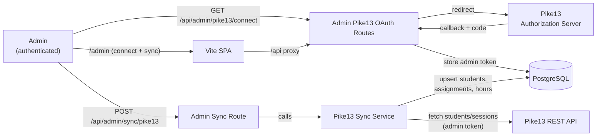

# Sprint 005 Technical Plan

## Architecture Version

- **From version**: architecture-004 (guardian feedback)
- **To version**: architecture-005 (Pike13 integration)

## Architecture Overview



---

## Component Design

### Component: Schema Migration

**Use Cases**: SUC-004, SUC-005

Add to `server/src/db/schema.ts`:

```ts
export const students = pgTable('students', {
  // ... existing columns unchanged ...
  githubUsername: text('github_username'),   // new, nullable
  pike13SyncId: text('pike13_sync_id'),      // new, nullable; Pike13 client ID
}, (t) => [
  unique().on(t.pike13SyncId),               // required for onConflictDoUpdate upsert
]);

export const volunteerHours = pgTable('volunteer_hours', {
  // ... existing columns unchanged ...
  externalId: text('external_id'),           // new, nullable; dedup key
}, (t) => [
  unique().on(t.source, t.externalId),
]);

// New table — single row, admin-level Pike13 OAuth tokens
export const pike13AdminToken = pgTable('pike13_admin_token', {
  id:           integer('id').primaryKey().generatedAlwaysAsIdentity(),
  accessToken:  text('access_token').notNull(),
  refreshToken: text('refresh_token'),
  expiresAt:    timestamp('expires_at', { withTimezone: true }),
  updatedAt:    timestamp('updated_at', { withTimezone: true }).defaultNow(),
});
```

> **NULL semantics**: Postgres excludes NULLs from unique constraint checks,
> so manual `volunteer_hours` rows (with `externalId = null`) are never
> subject to the constraint.

---

### Component: Admin Pike13 OAuth Routes (added to `server/src/routes/admin.ts`)

**Use Cases**: SUC-001

All routes require `isAdmin` middleware.

| Method | Path | Description |
|--------|------|-------------|
| GET | `/api/admin/pike13/connect` | Redirect to Pike13 authorization URL |
| GET | `/api/admin/pike13/callback` | Exchange code for token; store; redirect to admin dashboard |
| GET | `/api/admin/pike13/status` | Return `{ connected: boolean }` |

OAuth flow:
```ts
// connect: redirect to Pike13
const url = `https://pike13.com/oauth/authorize`
  + `?client_id=${PIKE13_CLIENT_ID}`
  + `&redirect_uri=${encodeURIComponent(PIKE13_CALLBACK_URL)}`
  + `&response_type=code`;
res.redirect(url);

// callback: exchange code, store single admin token row
const { access_token, refresh_token, expires_in } = await exchangeCode(code);
await db.delete(pike13AdminToken);  // ensure only one row
await db.insert(pike13AdminToken).values({ accessToken, refreshToken, expiresAt });
res.redirect('/admin');
```

Secrets: `PIKE13_CLIENT_ID`, `PIKE13_CLIENT_SECRET`, `PIKE13_CALLBACK_URL` —
added to `secrets/dev.env.example` and `secrets/prod.env.example`.

Dev callback URL: `http://localhost:3000/api/admin/pike13/callback`

---

### Component: Pike13 Sync Service (`server/src/services/pike13Sync.ts`)

**Use Cases**: SUC-002, SUC-003, SUC-004, SUC-005

Pure functions; HTTP calls injected for testability.

```ts
export interface SyncResult {
  studentsUpserted: number
  assignmentsCreated: number
  hoursCreated: number
}

export async function runSync(
  db: DrizzleDb,
  accessToken: string,
  fetchFn?: typeof fetch,   // injectable for tests
): Promise<SyncResult>
```

Key logic:
- **TA/VA filter**: `name.startsWith('TA ') || name.startsWith('VA ')` → skip
- **GitHub username**: read from custom field key `github_acct_name` on client
  record (confirm exact key once API access is available)
- **Student upsert** by `pike13SyncId`:
  ```ts
  .onConflictDoUpdate({ target: students.pike13SyncId, set: { name, guardianEmail, githubUsername } })
  ```
- **Volunteer hours** by `(source, externalId)`:
  ```ts
  .onConflictDoNothing()
  ```

Pike13 API endpoints used:
- `GET /api/v2/desk/people` — clients (students)
- `GET /api/v2/desk/event_occurrences` — sessions per instructor
- `GET /api/v2/desk/visits` — attendance per session

---

### Component: Admin Sync Endpoint (added to `server/src/routes/admin.ts`)

**Use Cases**: SUC-002

```
POST /api/admin/sync/pike13
```

Reads admin token from `pike13_admin_token`, calls `runSync`, returns counts.

Response:
```ts
{ studentsUpserted: number, assignmentsCreated: number, hoursCreated: number }
```

Returns `409` if no admin token is stored yet.

---

### Component: Admin Dashboard Updates (`client/src/pages/AdminDashboardPage.tsx`)

**Use Cases**: SUC-001, SUC-002

Add a "Pike13" section to the admin dashboard:

- Calls `GET /api/admin/pike13/status` on mount
- **Not connected**: shows "Pike13: Not Connected" + "Connect Pike13" button
  (navigates to `/api/admin/pike13/connect`)
- **Connected**: shows "Pike13: Connected" + "Sync Pike13" button
- Sync button calls `POST /api/admin/sync/pike13` via `useMutation` and
  displays result counts on success

Client types in `client/src/types/pike13.ts`:
```ts
export interface Pike13StatusDto { connected: boolean }
export interface Pike13SyncResultDto {
  studentsUpserted: number
  assignmentsCreated: number
  hoursCreated: number
}
```

---

## Decisions

1. **Single admin token, not per-instructor**: Instructors do not need to
   connect anything — the admin connects once with admin-level Pike13 access.
   All sync operations use this shared token.

2. **Admin-triggered sync only**: Avoids cron infrastructure for v1.

3. **Pure sync service with injected fetch**: Fully unit-testable without
   Pike13 network access.

4. **NULL exclusion from unique index**: Postgres naturally handles this —
   two NULL `externalId` values do not conflict.

5. **`pike13SyncId` unique constraint on students**: Required for
   `onConflictDoUpdate` upsert; nullable unique columns allow multiple NULLs
   in Postgres.

6. **Dev callback URL on port 3000**: Simpler — works in native dev and
   Docker dev without requiring the Vite proxy.

## Open Questions

1. **Pike13 `github_acct_name` field key**: Based on CSV export header, assumed
   to be `github_acct_name`. Confirm against live API response once credentials
   are available. The key is isolated to one constant in `pike13Sync.ts`.
