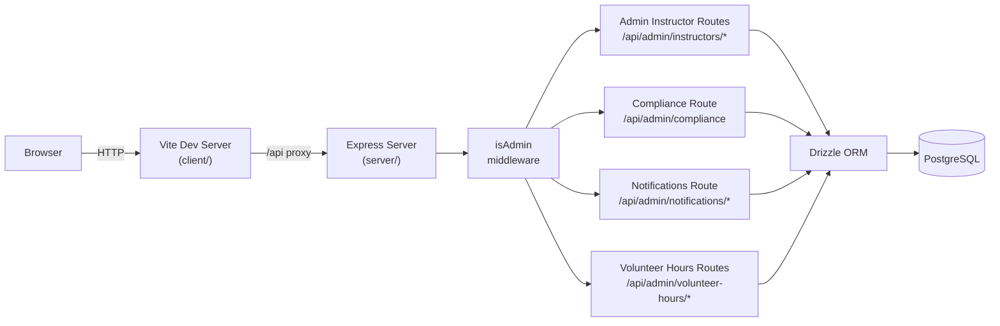

# Sprint 003 Technical Plan

## Architecture Version

- **From version**: architecture-002 (instructor review workflow, templates, TA check-in)
- **To version**: architecture-003 (admin panel: compliance, notifications, volunteer hours)

## Architecture Overview



All admin routes are protected by the existing `isAdmin` middleware. No new
auth logic is introduced. The `isAdmin` check already exists in
`server/src/middleware/auth.ts`.

---

## Component Design

### Component: Schema Addition — `volunteer_hours` table

**Use Cases**: SUC-004

Add to `server/src/db/schema.ts`:

```ts
export const volunteerHours = pgTable('volunteer_hours', {
  id: serial('id').primaryKey(),
  volunteerName: text('volunteer_name').notNull(), // free text; FK to users deferred to Sprint 005
  category: text('category').notNull(), // 'Teaching' | 'Fundraising' | 'Events' | 'Admin Support' | 'Other'
  hours: real('hours').notNull(), // real allows 0.5-hour increments for grant reporting
  description: text('description'),
  recordedAt: timestamp('recorded_at').notNull().defaultNow(),
  source: text('source').notNull().default('manual'), // 'manual' | 'pike13'
})

export type VolunteerHour = typeof volunteerHours.$inferSelect;
export type NewVolunteerHour = typeof volunteerHours.$inferInsert;
```

Run `npm run db:generate && npm run db:migrate` to produce the migration.

`volunteerName` stores a free-text name rather than a FK to `users` because
TAs do not yet have `users` rows (they appear as text names in `ta_checkins`).
This matches the pattern established by `taCheckins.taName`. Sprint 005 can
add a nullable `userId FK` alongside `volunteerName` when TA user accounts are
created.

`hours` uses `real` (float) rather than `integer` to support 0.5-hour
increments, which are common in nonprofit volunteer-hours grant reporting.

The `source` column is forward-compatible: Sprint 005 will insert rows with
`source = 'pike13'` for teaching hours derived from Pike13 session data.

---

### Component: Admin Instructor Routes (`server/src/routes/admin.ts`)

**Use Cases**: SUC-001, SUC-005

| Method | Path | Description |
|--------|------|-------------|
| GET | `/api/admin/instructors` | List all instructors with user info, active status, student count, ratio badge |
| PATCH | `/api/admin/instructors/:id` | Toggle `isActive` (`{ isActive: boolean }` body) |

`GET /api/admin/instructors` response shape (per instructor):
```ts
interface AdminInstructorDto {
  id: number
  userId: number
  name: string
  email: string
  isActive: boolean
  studentCount: number
  ratioBadge: 'ok' | 'warning' | 'alert' // computed vs threshold in admin_settings
}
```

The threshold is read from `admin_settings` where `email = 'max_students_per_instructor'`
(a sentinel row, value stored in the `email` column is reused as a settings
key/value store — see Open Questions). Default threshold = 6.

---

### Component: Compliance Route (`server/src/routes/admin.ts`)

**Use Cases**: SUC-002

| Method | Path | Description |
|--------|------|-------------|
| GET | `/api/admin/compliance?month=YYYY-MM` | Per-instructor review counts and check-in status for the month |

Response shape:
```ts
interface ComplianceRow {
  instructorId: number
  name: string
  pending: number
  draft: number
  sent: number
  recentCheckinSubmitted: boolean // did this instructor submit ta_checkins for the most-recent Monday on or before the last day of the queried month?
}
```

Queries:
- Review counts: `monthly_reviews` grouped by `instructorId` + `month`
- Check-in status: whether any `ta_checkins` row exists for this instructor
  with `weekOf` equal to the ISO date of the last Monday on or before the
  last day of the queried month (e.g. for `?month=2026-03`, use the last
  Monday ≤ 2026-03-31)

**Known limitation**: `recentCheckinSubmitted` shows the most-recent week's
status relative to the queried month, not a week-by-week breakdown. Admin
sees a single yes/no per instructor per month, which is sufficient for
compliance tracking at the LEAGUE's current scale. A per-week breakdown is
deferred to a future sprint.

The `currentWeekMonday()` utility from `server/src/routes/checkins.ts` should
be extracted to `server/src/utils/dateUtils.ts` so both checkins and the
compliance route share the same ISO-date arithmetic.

---

### Component: Admin Notifications Routes (`server/src/routes/admin.ts`)

**Use Cases**: SUC-003

| Method | Path | Description |
|--------|------|-------------|
| GET | `/api/admin/notifications` | List all notifications, newest first; `?unread=true` filter |
| PATCH | `/api/admin/notifications/:id/read` | Mark a notification as read |

Response shape (per notification):
```ts
interface AdminNotificationDto {
  id: number
  fromUserName: string
  message: string
  isRead: boolean
  createdAt: string
}
```

---

### Component: Volunteer Hours Routes (`server/src/routes/volunteer-hours.ts`)

**Use Cases**: SUC-004

| Method | Path | Description |
|--------|------|-------------|
| GET | `/api/admin/volunteer-hours` | List entries; query params: `userId`, `category`, `from`, `to` |
| POST | `/api/admin/volunteer-hours` | Create manual entry |
| PUT | `/api/admin/volunteer-hours/:id` | Update entry (manual only) |
| DELETE | `/api/admin/volunteer-hours/:id` | Delete entry (manual only; 403 if `source = 'pike13'`) |

POST/PUT body:
```ts
{
  volunteerName: string
  category: string
  hours: number   // supports 0.5 increments
  description?: string
  recordedAt?: string // ISO date; defaults to now
}
```

Response shape (`VolunteerHourDto`):
```ts
interface VolunteerHourDto {
  id: number
  volunteerName: string
  category: string
  hours: number
  description: string | null
  recordedAt: string
  source: 'manual' | 'pike13'
}
```

CSV export is handled client-side from the fetched data (no dedicated export
endpoint needed at this scale).

---

### Component: Admin Settings — Staff Ratio Threshold

**Use Cases**: SUC-001, SUC-005

The `admin_settings` table currently stores admin email addresses (whitelist).
For Sprint 003, a new row is seeded at migration time to store the staff ratio
threshold:

```sql
INSERT INTO admin_settings (email) VALUES ('config:max_students_per_instructor:6')
ON CONFLICT DO NOTHING;
```

This is a pragmatic reuse of the existing table. See Open Questions for the
recommended longer-term approach.

Alternatively — and more cleanly — the threshold defaults to `6` and is
hardcoded in the route handler, with a future ticket to make it configurable.
**The hardcoded default approach is preferred for Sprint 003.**

---

### Component: Frontend Admin Pages (`client/src/pages/admin/`)

**Use Cases**: SUC-001 through SUC-005

New routes added to `App.tsx` (all under `ProtectedRoute role="admin"`):

| Route | Component | Purpose |
|-------|-----------|---------|
| `/admin` | `AdminDashboardPage` | Notification inbox + summary stat cards |
| `/admin/instructors` | `InstructorListPage` | Instructor list with activate/deactivate and ratio badges |
| `/admin/compliance` | `CompliancePage` | Month-picker + per-instructor review/check-in table |
| `/admin/volunteer-hours` | `VolunteerHoursPage` | Hours list, add/edit/delete form, filters, CSV export |

New shared component: `AdminLayout` — sidebar nav linking to the four admin
pages; wraps all admin routes.

New client types in `client/src/types/admin.ts`:
```ts
interface AdminInstructorDto { ... }
interface ComplianceRow { ... }
interface AdminNotificationDto { ... }
interface VolunteerHourDto { ... }
```

---

## Decisions

1. **Single admin route file**: All admin API routes (instructors, compliance,
   notifications) live in `server/src/routes/admin.ts`. Volunteer hours get
   their own file (`volunteer-hours.ts`) due to the amount of CRUD. This keeps
   admin logic grouped without making one file excessively long. Both files
   must be imported and registered in `server/src/index.ts` with
   `app.use('/api', adminRouter)` and `app.use('/api', volunteerHoursRouter)`,
   following the same pattern as the existing route registrations.

2. **Staff ratio is computed, not stored**: Ratio badges are recomputed on each
   request from `instructor_students` JOIN `instructors`. This avoids stale
   data between Pike13 syncs (Sprint 005). Performance is acceptable at the
   LEAGUE's scale (~20–30 instructors).

3. **Threshold hardcoded to 6 in Sprint 003**: Rather than abusing `admin_settings`
   as a key/value store, the threshold defaults to 6 in code. A future sprint
   can add a proper settings UI if needed. The SUC-005 acceptance criterion
   "threshold is read from admin_settings" is updated to reflect this scope.

4. **CSV export is client-side**: The volunteer hours list response is already
   a flat array of records. A small utility in the frontend (`exportToCsv`)
   converts the fetched data to a downloadable CSV without a server-side
   endpoint.

5. **Check-in status in compliance uses most-recent Monday**: The compliance
   table shows whether each instructor submitted a `ta_checkins` batch for the
   Monday of the currently displayed month's most recent completed week. This
   avoids needing a separate week picker and matches the existing check-in
   model.

---

## Open Questions

1. **`admin_settings` overload**: Using the `email` column as a general
   key/value store is a code smell. Should Sprint 003 introduce a proper
   `settings` table (`key text PK, value text`)? Decision: defer; use
   hardcoded threshold for now.

2. **Volunteer lookup by `userId`**: The volunteer hours form needs a list of
   user IDs to fill the volunteer picker. Should the admin see only instructors,
   or all users (including TAs who have user accounts)? Decision: for Sprint 003,
   the admin manually types the volunteer's name as a free-text field
   (`volunteerName text`) rather than a FK to `users.id`. The FK becomes useful
   in Sprint 005 when TA user accounts are created. Schema adjustment: replace
   `userId integer` with `volunteerName text` in `volunteer_hours`.

3. **Compliance date logic for check-in**: The "most recent Monday" computation
   must be consistent across timezones. Decision: use server-side UTC date
   arithmetic; the LEAGUE operates in a single timezone (San Diego, PT) and
   discrepancies at midnight are acceptable.
